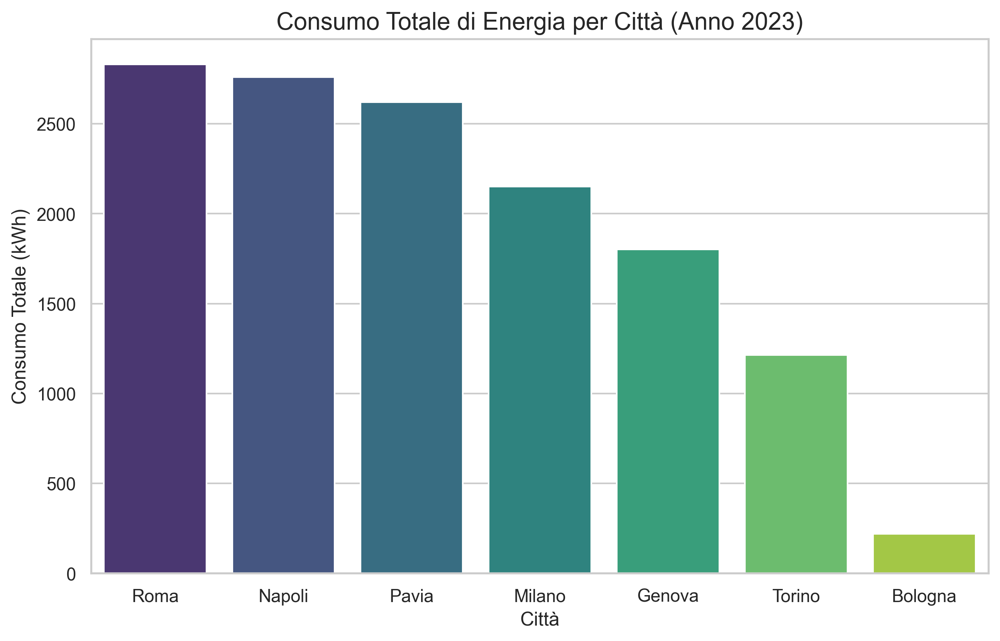

# ⚡ Energy Data Analysis: Cleaning & Reporting

## 📌 Obiettivo del Progetto
Questo repository contiene un caso studio completo di **Data Cleaning** e **Analisi Descrittiva** applicato al settore Utility (Energia e Gas). 
Il progetto dimostra come trasformare flussi di dati grezzi, spesso contenenti errori di lettura o incongruenze anagrafiche, in informazioni affidabili per il management.

## 🛠️ Stack Tecnologico
* **Linguaggio:** Python 3.x
* **Librerie Core:** * `Pandas`: Manipolazione e aggregazione dati.
    * `Matplotlib` / `Seaborn`: Visualizzazione statistica.

## 🔍 Problematiche Gestite (Data Cleaning)
Il dataset simulato riflette le sfide reali dei database energetici:
* **Outliers e Anomalie:** Identificazione di letture contatore fuori scala (es. 10.000 kWh) e ricalcolo basato sulla media storica del punto di prelievo (POD).
* **Integrità Temporale:** Conversione di formati data misti (ISO/Italiano) e correzione di mesi/giorni inesistenti tramite tecniche di *coercion*.
* **Normalizzazione Anagrafica:** Pulizia di stringhe sporche (es. "Milno" -> "Milano") e rimozione di caratteri speciali nelle tariffe tramite RegEx.
* **Dati Mancanti:** Gestione dei valori `NaN` nei consumi per evitare distorsioni nei calcoli di fatturazione.

## 📊 Analisi Prodotte
1. **Consumo Mensile per Città:** Analisi aggregata per identificare i mercati geografici con maggiore prelievo energetico.
3. **Data Visualization:** Grafici a barre e linee per comunicare immediatamente i trend stagionali del 2023.

